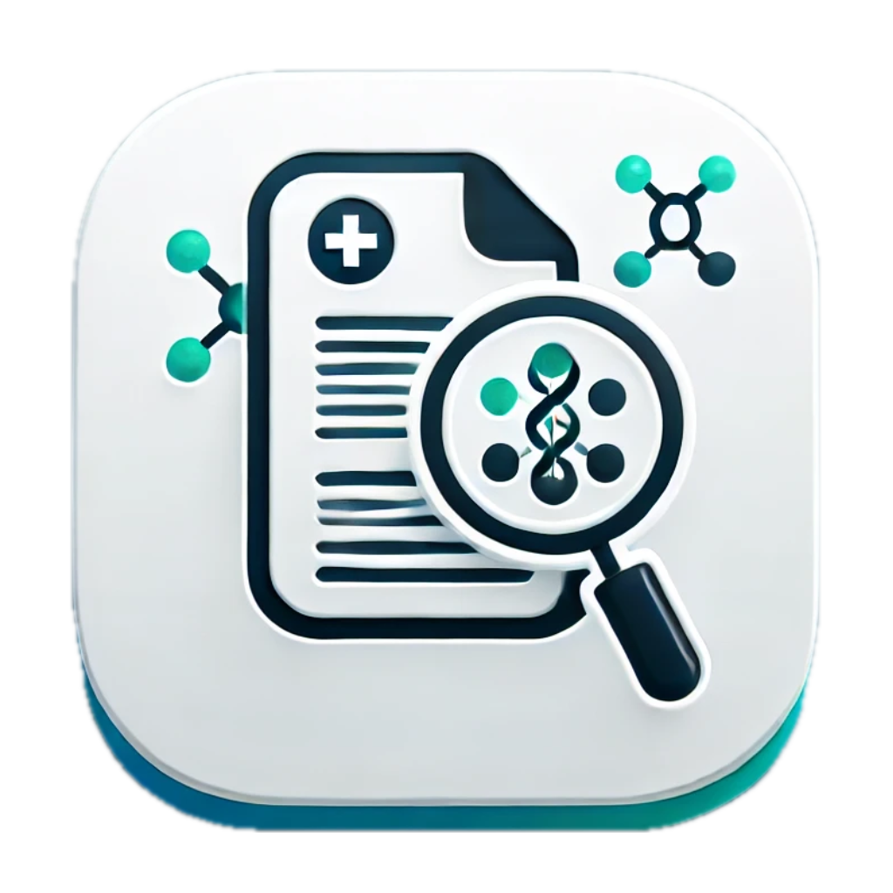

#  Clinical Trials Explorer

This repository includes the source code of version 2 of the clinical trials explorer introduced in the paper "[Repurposing of H1-receptor antagonists (levo)cetirizine, (des)loratadine, and fexofenadine as a case study for systematic analysis of trials on clinicaltrials.gov using semi-automated processes with custom-coded software
](https://doi.org/10.1007/s00210-023-02796-9)".

This new version is build to work with the new version of the clinicaltrials.gov API and has a number of new features and improvements. It is easier to use for beginner users and does _not_ require extensive computer and programming skills.

You can find find [version 1 here](https://github.com/T-Specht/h1ra-repurpose/).

## Installation

Download and install the version for your operating system from the releases.
